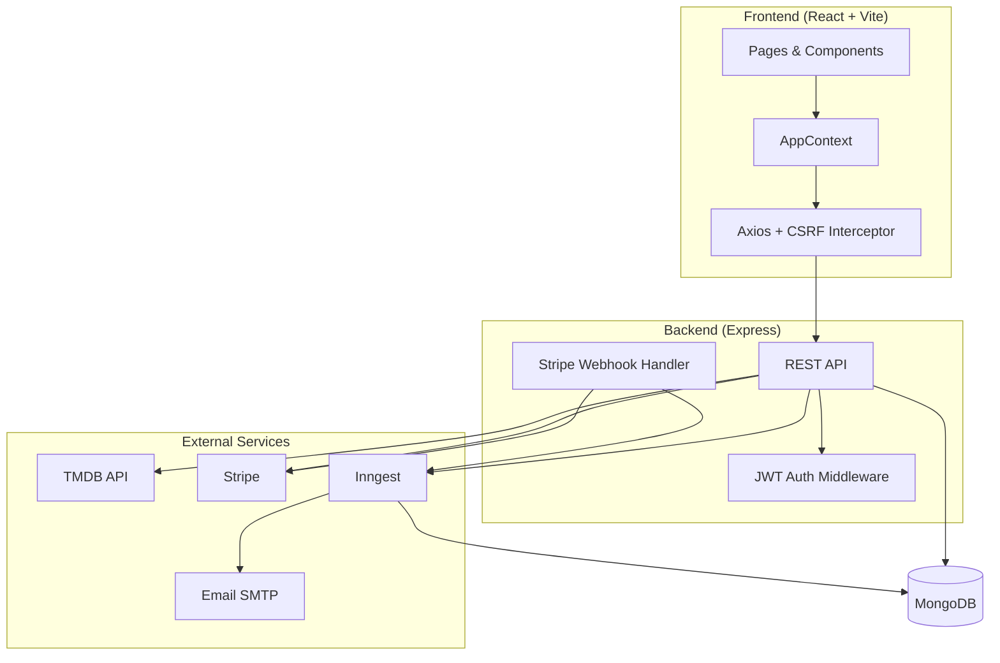

# QuickShow — Movie Ticket Booking Platform

A full-stack movie ticket booking application where users browse movies, select showtimes, reserve seats, and pay via **Stripe**. Admins manage shows, bookings, and users from a dedicated dashboard.

**Live demo:** [_Deployed_ ](https://movie-ticket-booking-gilt.vercel.app/) 
**Repository:** [github.com/templehubsakshi/Movie-Ticket-Booking](https://github.com/templehubsakshi/Movie-Ticket-Booking)

---

## Table of Contents

- [Features](#features)
- [Tech Stack](#tech-stack)
- [Architecture](#architecture)
- [Project Structure](#project-structure)
- [Prerequisites](#prerequisites)
- [Environment Variables](#environment-variables)
- [Local Setup](#local-setup)
- [Create an Admin User](#create-an-admin-user)
- [Stripe Webhook Setup](#stripe-webhook-setup)
- [Inngest Background Jobs](#inngest-background-jobs)
- [API Reference](#api-reference)
- [Database Models](#database-models)
- [Security](#security)
- [Deployment](#deployment)
- [Troubleshooting](#troubleshooting)
- [Future Improvements](#future-improvements)
- [Author](#author)

---

## Features

### User Features
- Browse now-playing and upcoming movies (powered by **TMDB**)
- View movie details, trailers, and cast information
- Select show date, time, and seats (interactive seat map)
- Secure checkout with **Stripe Checkout**
- View booking history and payment status
- Add/remove movies to favorites
- Update profile (name and avatar image URL)
- Email confirmation after successful payment
- Automated show reminder emails (~8 hours before showtime)

### Admin Features
- Admin dashboard with revenue, booking, and user stats
- Fetch now-playing movies from TMDB and schedule showtimes
- Set ticket price per show
- List and delete upcoming shows
- View all bookings across users
- Manage users and toggle admin roles
- Promote users via CLI seed script

### Platform Features
- JWT authentication with **HttpOnly cookies**
- CSRF protection (development)
- Rate limiting on auth routes
- Atomic seat reservation (prevents double booking)
- Background job processing with **Inngest**
- Stripe webhook verification with idempotent payment handling
- Unpaid booking cleanup (seats released after 31 minutes)

---

## Tech Stack

| Layer | Technologies |
|--------|-------------|
| **Frontend** | React 19, Vite 7, React Router 7, Tailwind CSS 4, Axios, React Hot Toast, Lucide React |
| **Backend** | Node.js, Express 5, Mongoose 9 |
| **Database** | MongoDB |
| **Payments** | Stripe Checkout + Webhooks |
| **Background Jobs** | Inngest (events + cron) |
| **Email** | Nodemailer (Resend SMTP) |
| **External API** | The Movie Database (TMDB) |
| **Security** | Helmet, express-rate-limit, bcryptjs, JWT, CSRF (dev) |
| **Deployment** | Vercel (frontend + backend) |

---

## Architecture



### Booking & Payment Flow

1. User selects showtime and seats on the frontend.
2. Backend **atomically reserves seats** in MongoDB (`findOneAndUpdate` with seat existence checks).
3. A `Booking` document is created with `isPaid: false`.
4. Stripe Checkout session is created; user is redirected to pay.
5. Inngest schedules a **31-minute cleanup** job for unpaid bookings.
6. Stripe sends `checkout.session.completed` webhook → booking marked `isPaid: true`.
7. Inngest sends a **confirmation email** to the user.
8. If payment is not completed within 31 minutes, seats are released and the booking is deleted.

---

## Project Structure

```
Movie-Ticket-Booking/
├── clieny/                      # Frontend (React + Vite)
│   ├── src/
│   │   ├── components/          # Navbar, MovieCard, ProtectedRoute, etc.
│   │   ├── context/             # AppContext (auth, shows, favorites)
│   │   ├── lib/                 # Axios CSRF setup, date helpers
│   │   ├── pages/               # User pages (Home, SeatLayout, Login, ...)
│   │   │   └── admin/           # Admin dashboard pages
│   │   ├── App.jsx              # Route definitions
│   │   └── main.jsx             # App entry point
│   ├── .env                     # Frontend env (do not commit)
│   └── package.json
│
├── server/                      # Backend (Express)
│   ├── configs/                 # DB, CSRF, email, constants
│   ├── controllers/             # Business logic
│   ├── inngest/                 # Background job functions
│   ├── middleware/              # JWT auth & admin guards
│   ├── models/                  # Mongoose schemas
│   ├── routes/                  # API route definitions
│   ├── scripts/
│   │   └── makeAdmin.js         # Promote a user to admin
│   ├── server.js                # Express app entry point
│   ├── .env                     # Backend env (do not commit)
│   └── package.json
│
└── README.md
```

> **Note:** The frontend folder is named `clieny` in this repository.

---

## Prerequisites

Before running locally, ensure you have:

- **Node.js** 18+ and **npm**
- **MongoDB** database ([MongoDB Atlas](https://www.mongodb.com/atlas) free tier works)
- **TMDB API key** — [Create account & API key](https://www.themoviedb.org/settings/api)
- **Stripe account** — [Stripe Dashboard](https://dashboard.stripe.com/) (test mode for development)
- **Inngest account** — [Inngest Cloud](https://www.inngest.com/) (for background jobs)
- **SMTP credentials** — e.g. [Resend](https://resend.com/) for transactional emails (optional for local dev)

---

## Environment Variables

### Backend — `server/.env`

Create `server/.env` in the server directory:

```env
# Server
PORT=3000
NODE_ENV=development

# MongoDB (database name "quickshow" is appended automatically)
MONGODB_URI=mongodb+srv://<username>:<password>@<cluster>.mongodb.net

# JWT
JWT_SECRET=your_super_secret_jwt_key_min_32_chars
JWT_EXPIRES_IN=7d

# CORS — comma-separated allowed frontend origins
ALLOWED_ORIGINS=http://localhost:5173

# Client URL used for Stripe redirect URLs (never trust request Origin header)
CLIENT_URL=http://localhost:5173

# TMDB
TMDB_API_KEY=your_tmdb_bearer_token

# Stripe
STRIPE_SECRET_KEY=sk_test_...
STRIPE_WEBHOOK_SECRET=whsec_...

# Email (optional — emails are skipped if not set)
SMTP_USER=resend
SMTP_PASS=re_...
SENDER_EMAIL=onboarding@yourdomain.com

# Inngest (required in production)
INNGEST_EVENT_KEY=your_inngest_event_key
INNGEST_SIGNING_KEY=your_inngest_signing_key
```

### Frontend — `clieny/.env`

Create `clieny/.env` in the frontend directory:

```env
VITE_BASE_URL=http://localhost:3000
VITE_TMDB_IMAGE_BASE_URL=https://image.tmdb.org/t/p/w500
VITE_CURRENCY=$
```

| Variable | Description |
|----------|-------------|
| `VITE_BASE_URL` | Backend API base URL |
| `VITE_TMDB_IMAGE_BASE_URL` | TMDB image CDN prefix for posters |
| `VITE_CURRENCY` | Currency symbol shown in UI |

> **Important:** Never commit `.env` files. They are listed in `.gitignore`. If secrets were ever pushed to Git, rotate all keys immediately.

---

## Local Setup

### 1. Clone the repository

```bash
git clone https://github.com/templehubsakshi/Movie-Ticket-Booking.git
cd Movie-Ticket-Booking
```

### 2. Install backend dependencies

```bash
cd server
npm install
```

### 3. Install frontend dependencies

```bash
cd ../clieny
npm install
```

### 4. Configure environment files

- Copy the [environment variable templates](#environment-variables) above into `server/.env` and `clieny/.env`.
- Fill in your MongoDB, TMDB, Stripe, and other credentials.

### 5. Start the backend

```bash
cd server
npm run server
```

The API runs at **http://localhost:3000**

### 6. Start the frontend (new terminal)

```bash
cd clieny
npm run dev
```

The app runs at **http://localhost:5173**

### 7. Register a user

Open http://localhost:5173/register and create an account.

---

## Create an Admin User

Admin routes require `isAdmin: true` on the user document. After registering, promote your account:

```bash
cd server
node scripts/makeAdmin.js your@email.com
```

Example:

```bash
node scripts/makeAdmin.js sakshi@example.com
```

Then log in and visit **http://localhost:5173/admin**.

---

## Stripe Webhook Setup

Payment confirmation is handled server-side via Stripe webhooks (not the browser redirect).

### Local development (Stripe CLI)

1. Install the [Stripe CLI](https://stripe.com/docs/stripe-cli).
2. Log in: `stripe login`
3. Forward webhooks to your local server:

```bash
stripe listen --forward-to localhost:3000/api/stripe/webhook
```

4. Copy the webhook signing secret (`whsec_...`) into `server/.env` as `STRIPE_WEBHOOK_SECRET`.

### Production

1. In Stripe Dashboard → **Developers → Webhooks**, add endpoint:
   - URL: `https://your-api-domain.com/api/stripe/webhook`
   - Events: `checkout.session.completed`, `checkout.session.expired`
2. Copy the signing secret to your production environment variables.

> The webhook route must receive the **raw request body**. In `server.js`, it is registered **before** `express.json()` for this reason.

---

## Inngest Background Jobs

Inngest powers asynchronous workflows:

| Function | Trigger | Purpose |
|----------|---------|---------|
| `release-seats-delete-booking` | Event `app/checkpayment` | Wait 31 min; release seats if unpaid |
| `send-booking-confirmation-email` | Event `app/show.booked` | Send payment confirmation email |
| `send-show-reminders` | Cron `0 */8 * * *` | Remind paid users ~8h before show |
| `send-new-show-notifications` | Event `app/show.added` | Notify users when admin adds a show |

### Local development

1. Sign up at [Inngest](https://www.inngest.com/).
2. Run the Inngest dev server alongside your backend:

```bash
npx inngest-cli@latest dev -u http://localhost:3000/api/inngest
```

3. Ensure your Express app exposes the Inngest serve endpoint at `/api/inngest`.

---

## API Reference

Base URL: `http://localhost:3000` (local)

### Authentication — `/api/auth`

| Method | Endpoint | Auth | Description |
|--------|----------|------|-------------|
| `POST` | `/register` | Public | Register new user |
| `POST` | `/login` | Public | Login and set auth cookie |
| `POST` | `/logout` | Public | Clear auth cookies |
| `GET` | `/me` | User | Get current logged-in user |

### Shows — `/api/show`

| Method | Endpoint | Auth | Description |
|--------|----------|------|-------------|
| `GET` | `/now-playing` | Admin | Fetch now-playing movies from TMDB |
| `POST` | `/add` | Admin | Add showtimes for a movie |
| `GET` | `/all` | Public | List movies with upcoming shows |
| `GET` | `/:movieId` | Public | Get movie details and showtimes by date |
| `DELETE` | `/:showId` | Admin | Delete a show and its bookings |

### Bookings — `/api/booking`

| Method | Endpoint | Auth | Description |
|--------|----------|------|-------------|
| `POST` | `/create` | User | Reserve seats and create Stripe session |
| `GET` | `/seats/:showId` | Public | Get occupied seat IDs for a show |
| `POST` | `/check-payment` | Admin | Manually trigger payment status check |

### User — `/api/user`

| Method | Endpoint | Auth | Description |
|--------|----------|------|-------------|
| `GET` | `/bookings` | User | Get logged-in user's bookings |
| `GET` | `/favorites` | User | Get favorited movies |
| `POST` | `/update-favorite` | User | Toggle a movie in favorites |
| `PUT` | `/update-profile` | User | Update name and/or profile image |

### Admin — `/api/admin`

| Method | Endpoint | Auth | Description |
|--------|----------|------|-------------|
| `GET` | `/is-admin` | Admin | Verify admin access |
| `GET` | `/dashboard` | Admin | Dashboard stats (revenue, bookings, users) |
| `GET` | `/all-shows` | Admin | List all upcoming shows |
| `GET` | `/all-bookings` | Admin | List all bookings |
| `GET` | `/users` | Admin | List all users |
| `PUT` | `/users/:userId/toggle-admin` | Admin | Promote or demote admin role |

### Webhooks

| Method | Endpoint | Description |
|--------|----------|-------------|
| `POST` | `/api/stripe/webhook` | Stripe payment event handler |

---

## Database Models

### User
- `name`, `email` (unique), `password` (bcrypt, hidden by default)
- `image`, `isAdmin`, `favorites[]`

### Movie
- Cached TMDB data; `_id` is the TMDB movie ID (string)
- `title`, `overview`, `poster_path`, `genres`, `casts`, `runtime`, etc.

### Show
- `movie` (ref), `showDateTime`, `showPrice`
- `occupiedSeats` — Map of seat key → userId (e.g. `"A1"` → `"674abc..."`)
- Unique compound index on `{ movie, showDateTime }`

### Booking
- `user`, `show`, `amount`, `bookedSeats[]`, `isPaid`, `paymentLink`

**Seat layout:** Rows `A`–`J`, columns `1`–`9` (max 5 seats per booking).

---

## Security

| Feature | Implementation |
|---------|----------------|
| Password hashing | bcrypt (12 rounds) |
| Authentication | JWT in HttpOnly cookie (`auth_token`) |
| Authorization | `protectRoute` and `protectAdmin` middleware |
| CSRF | Double-submit cookie pattern (enabled in development) |
| Rate limiting | 20 requests / 15 min on `/api/auth` |
| HTTP headers | Helmet |
| CORS | Whitelist with `credentials: true` |
| Seat validation | Regex allowlist `/^[A-J][1-9]$/` |
| Double booking prevention | Atomic MongoDB `findOneAndUpdate` |
| Stripe security | Webhook signature verification + amount mismatch check |
| Idempotency | Duplicate webhook events do not double-mark bookings paid |
| Email XSS | HTML escaping in email templates |

---

## Deployment

This project is configured for **Vercel** deployment with separate frontend and backend projects.

### Backend (Vercel)

1. Deploy the `server/` directory as a Node.js project.
2. Set all [backend environment variables](#backend--serverenv).
3. Set `NODE_ENV=production`.
4. Set `ALLOWED_ORIGINS` to your frontend URL (e.g. `https://your-app.vercel.app`).
5. Set `CLIENT_URL` to the same frontend URL.
6. Configure Stripe webhook to point to `https://your-api.vercel.app/api/stripe/webhook`.
7. Connect Inngest to your production `/api/inngest` endpoint.

### Frontend (Vercel)

1. Deploy the `clieny/` directory.
2. Set `VITE_BASE_URL` to your deployed backend URL.
3. Set `VITE_TMDB_IMAGE_BASE_URL` and `VITE_CURRENCY`.

### Production cookie notes

In production, auth cookies use `sameSite: "none"` and `secure: true` so cookies work across different Vercel subdomains (frontend and API on separate domains).

---

## Troubleshooting

| Issue | Solution |
|-------|----------|
| Login works but API returns 401 | Check `ALLOWED_ORIGINS`, cookie `sameSite` settings, and `withCredentials: true` on Axios |
| Stripe webhook signature fails | Ensure webhook route is registered before `express.json()`; use raw body middleware |
| Payment succeeds but booking not confirmed | Verify Stripe webhook is configured and `STRIPE_WEBHOOK_SECRET` is correct |
| Emails not sending | Set `SMTP_USER`, `SMTP_PASS`, and `SENDER_EMAIL`; check Inngest logs |
| Admin page redirects to home | Run `makeAdmin.js` for your email; ensure you are logged in |
| Seats stuck as occupied | Unpaid bookings auto-release after 31 minutes via Inngest |
| CORS error | Add your frontend URL to `ALLOWED_ORIGINS` |

---

## Future Improvements

- [ ] Rename `clieny/` → `client/`
- [ ] Add TypeScript
- [ ] Add unit and integration tests
- [ ] WebSocket live seat updates
- [ ] Redis-based distributed seat locking for high concurrency
- [ ] Enable CSRF protection in production
- [ ] Add Docker Compose for local development
- [ ] Remove unused dependencies and committed secrets from git history

---

## Author

**Sakshi**  
GitHub: [@templehubsakshi](https://github.com/templehubsakshi)

---

## License

This project is open source and available under the [MIT License](LICENSE).

